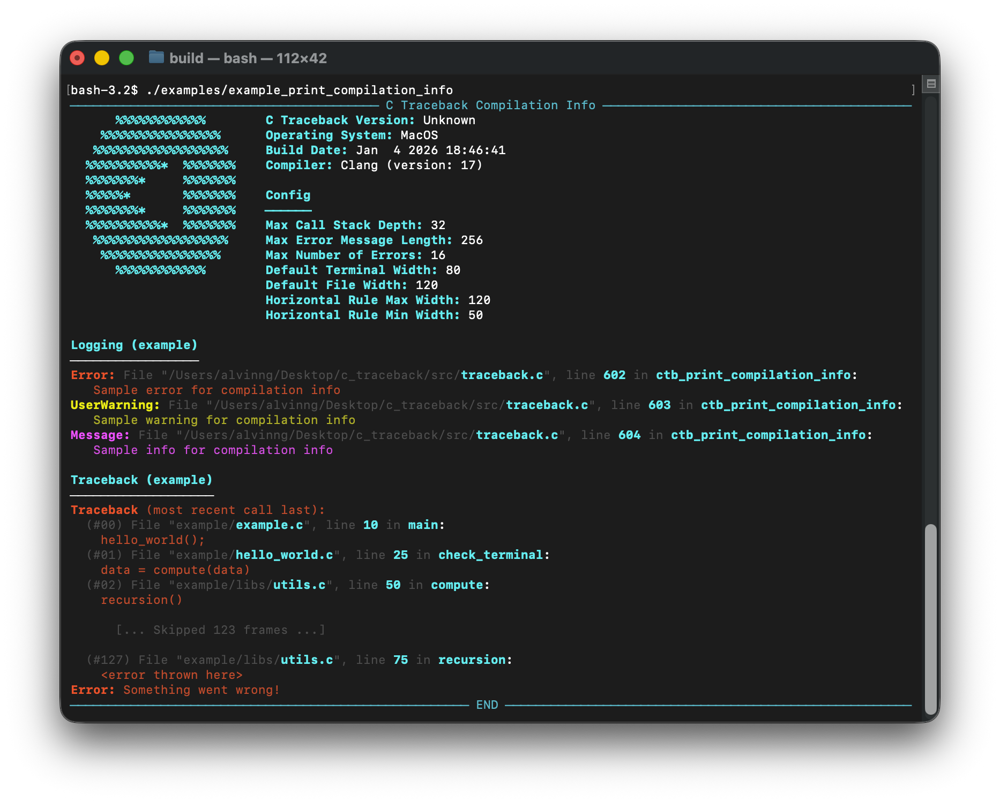

# C Traceback
A colorful, lightweight error-propagation framework for C.

Documentation Website: [https://www.ctraceback.com](https://www.ctraceback.com)



## Features
* Beautiful tracebacks
* Works with Signal Handlers
* Fast and Thread-safe
* Explicit control flow
* Works with MSVC, Clang and GCC
* Written in C99 with minimal dependencies
* [Detailed documentations](https://www.ctraceback.com/)

## Sample usage
```c
#include <stdio.h>
#include <stdlib.h>
#include "c_traceback.h"

#define N 100

static void do_calculation(double *vec);

int main(void)
{
    ctb_clear_context();
    ctb_install_signal_handler();

    double *vec = malloc(N * sizeof(double));
    if (!vec)
    {
        THROW(CTB_MEMORY_ERROR, "Failed to allocate memory");
        goto error;
    }

    TRY_GOTO(do_calculation(vec), error);
    printf("This shouldn't be printed if there is error\n");

    free(vec);
    return 0;

error:
    free(vec);
    ctb_dump_traceback(); // Log traceback and reset context
    return 0;
}

static void do_calculation(double *vec)
{
    // Initialize array
    for (int i = 0; i < N; i++)
    {
        vec[i] = 0;
    }

    // Calculations
    for (int i = 0; i < N; i++)
    {
        vec[i] += 10;
    }
}
```

## Support Us
* ⭐  Give us a star
<!-- * ❤️  Sponsor -->
* 👤  [Follow](https://github.com/alvinng4)